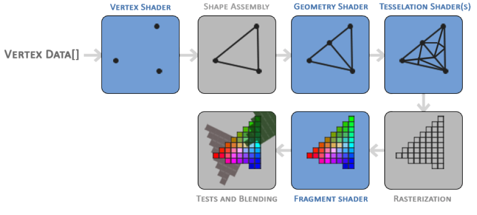

# Theory of OpenGL

## Important Facts

>There is a difference between a 2D coordinate and a pixel. A 2D coordinate is a
very precise representation of where a point is in 2D space, while a 2D pixel is an
approximation of that point limited by the resolution of your screen/window.

#### Double Buffer approach
When an application draws in a single buffer the resulting image might display flickering
issues. This is because the resulting output image is not drawn in an instant, but drawn
pixel by pixel and usually from left to right and top to bottom. Because these images are
not displayed at an instant to the user, but rather via a step by step generation the result
may contain quite a few artifacts. To circumvent these issues, windowing applications
apply a double buffer for rendering. The front buffer contains the final output image
that is shown at the screen, while all the rendering commands draw to the back buffer.
As soon as all the rendering commands are finished we swap the back buffer to the front
buffer so the image is instantly displayed to the user, removing all the aforementioned
artifacts.

#### Shaders
Graphics card have thousands of small processing cores that quickly process your data within the graphics pipeline by running small programs on the GPU for each step of the pipeline. The small programs are called shaders.
Shaders are written in the OpenGL Shading Language (GLSL)

As input to the graphics pipeline we pass in a list of three 3D coordinates that should form a triangle in an array here called Vertex Data; this vertex data is a collection of vertices. A vertex is basically a collection of data per 3D coordinate. This vertex’s data is represented using vertex attributes that can contain any data we’d like but for simplicity’s sake let’s assume that each vertex consists of just a 3D position and some color value.

>In order for OpenGL to know what to make of your collection of coordinates and color
values OpenGL requires you to hint what kind of render types you want to form with the
data. Do we want the data rendered as a collection of points, a collection of triangles or
perhaps just one long line? Those hints are called primitives and are given to OpenGL
while calling any of the drawing commands. Some of these hints are GL_POINTS,
GL_TRIANGLES and GL_LINE_STRIP.

## Parts of the pipeline

1. ##### Vertex Shaders
The main purpose of the vertex shader is to transform 3D coordinates into different 3D coordinates (more on
that later) and the vertex shader allows us to do some basic processing on the vertex attributes.

2. ##### Primitive Assembly
Takes as input all the vertices (or vertex if GL_POINTS is chosen)
from the vertex shader that form a primitive and assembles all the point(s) in the primitive shape
given; in this case a triangle.

3. ##### Geometry Shader
The geometry shader takes as input a collection of vertices that form a primitive and has the ability to generate other shapes by emitting new vertices to form new (or other) primitive(s). In this example case, it generates a second triangle out of the given shape.

4. ##### Tessellation Shader
They have the ability to subdivide the given primitive into many smaller
primitives. This allows you to for example create much smoother environments by creating more triangles the smaller the distance to the player.
> Output of tessellation shaders is passed on to the rasterization stage where mapping between resulting primitives to pixel on the screen happens. Before Fragment Shader runs, clipping is performed, and any fragments that are outside the view are discarded for performances's sake.

5. ##### Fragment Shader
Its role is to calculate the final color of a pixel and this
is usually the stage where all the advanced OpenGL effects occur. Usually the fragment shader contains data about the 3D scene that it can use to calculate the final pixel color (like lights, shadows, color of the light and so on).

###### Note

* The geometry shader and the tessellation shaders are optional and usually left to their default shaders.
* In Modern OpenGL we are required to define at least a vertex and fragment shader of our own (there are no default vertex/fragment shaders on the GPU).
